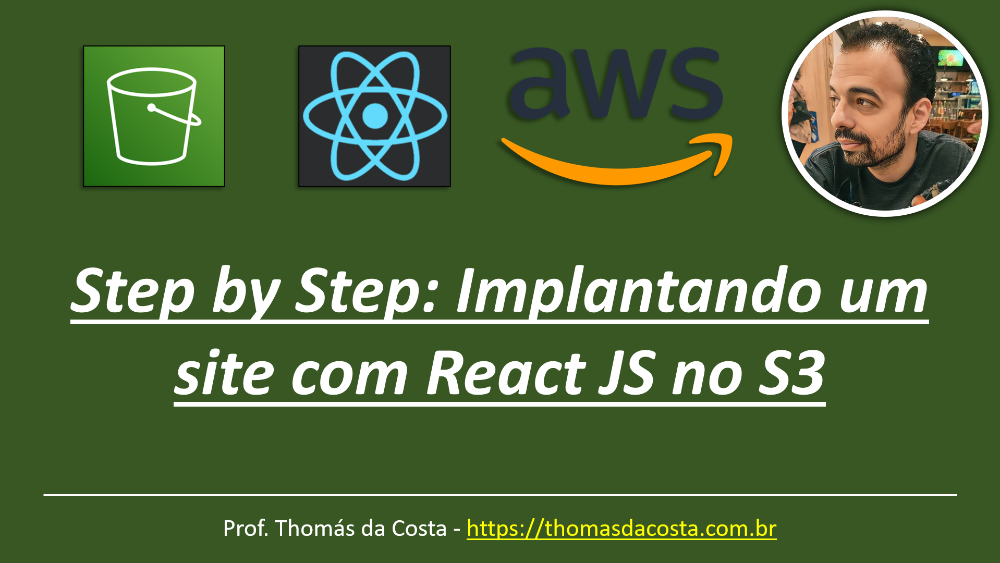

# Armazenamento - LAB: Implantando um site com React JS no S3

Tutorial passo a passo de como implantar um site estático desenvolvido com React JS dentro de um bucket no AWS S3.

## Link do Tutorial

https://thomasdacosta.com.br/2023/08/24/step-by-step-implantando-um-site-com-react-js-no-s3/

---

Thomás da Costa - [https://thomasdacosta.com.br](https://thomasdacosta.com.br)