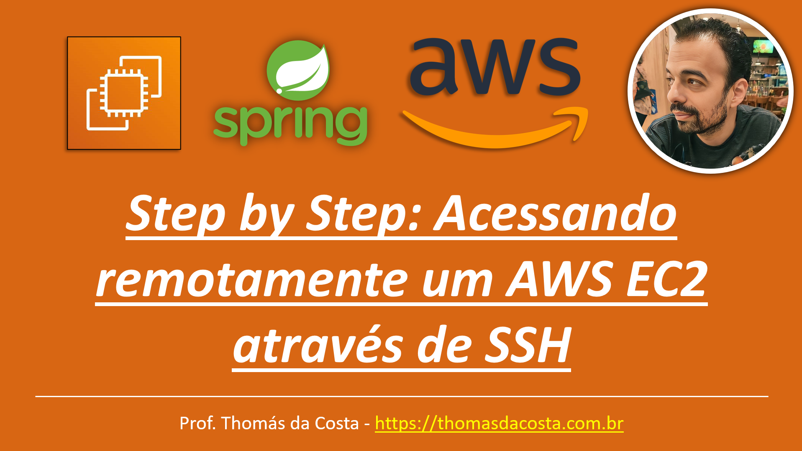

# Máquinas Virtuais - LAB: Acessando remotamente um AWS EC2 através de SSH

Tutorial de como implantar um servidor EC2 para subir um microsserviço desenvolvido em Spring Boot. Este guia é composto por mais partes onde em tutoriais futuros, subiremos o restante da aplicação para expor o serviço para que os usuários possam utilizar.

## Link do Tutorial

https://thomasdacosta.com.br/2023/09/03/step-by-step-acessando-remotamente-um-aws-ec2-atraves-de-ssh/

## Código Fonte
https://github.com/thomasdacosta/spring-boot-localstack/tree/spring-boot-localstack-maquinas_virtuais

---

Thomás da Costa - [https://thomasdacosta.com.br](https://thomasdacosta.com.br)
