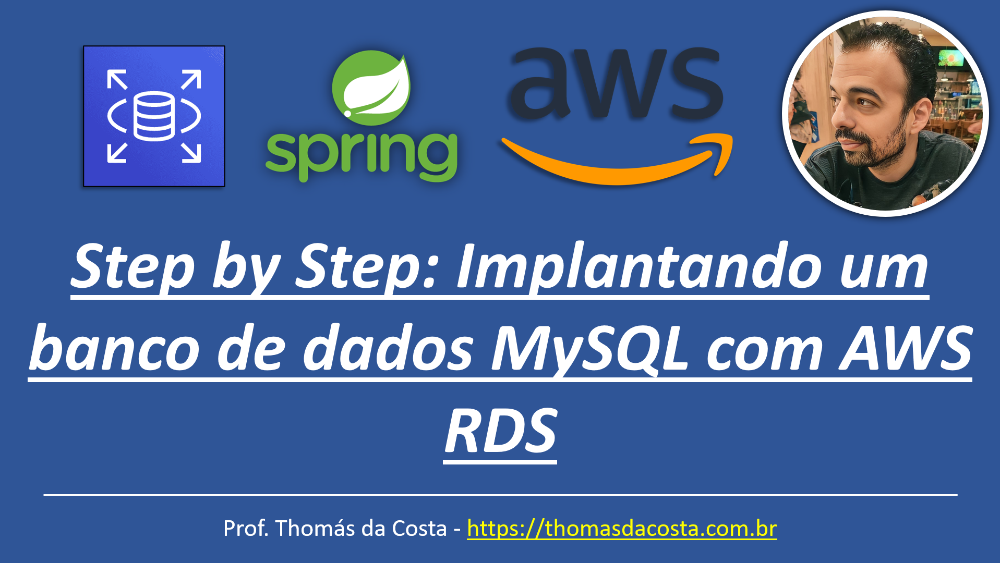

# Banco de Dados - LAB: Implantando um banco de dado MySQL com AWS RDS

Tutorial de como implantar um banco de dados RDS para subir um microsserviço desenvolvido em Spring Boot. Este guia é composto por mais partes onde em tutoriais futuros, subiremos o restante da aplicação para expor o serviço para que os usuários possam utilizar.

## Link do Tutorial

https://thomasdacosta.com.br/2023/09/09/step-by-step-implantando-um-banco-de-dado-mysql-com-aws-rds/

---

Thomás da Costa - [https://thomasdacosta.com.br](https://thomasdacosta.com.br)