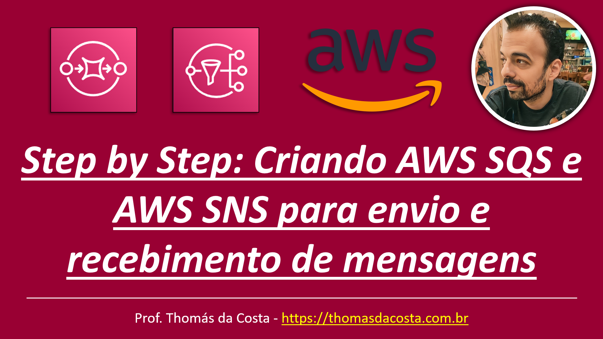

# Serviços de Mensageria - LAB: Criando AWS SQS e AWS SNS para envio e recebimento de mensagens

Tutorial de como implantar um SQS para receber mensagens a partir de um SNS. O SQS também pode receber mensagens externas de outras aplicações ou de produtos da AWS e a partir de um microsserviço desenvolvido em Spring Boot.

## Link do Tutorial

https://thomasdacosta.com.br/2023/09/17/step-by-step-criando-aws-sqs-e-aws-sns-para-envio-e-recebimento-de-mensagens/

---

Thomás da Costa - [https://thomasdacosta.com.br](https://thomasdacosta.com.br)