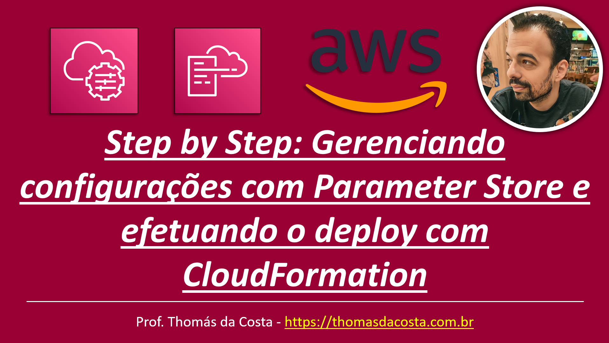

# Configuração - LAB: Gerenciando configurações com Parameter Store e CloudFormation

Tutorial de como implantar os parâmetros de configuração do microsserviço em Spring Boot usando um script do CloudFormation e o Parameter Store.

## Link do Tutorial

https://thomasdacosta.com.br/2023/09/23/step-by-step-gerenciando-configuracoes-com-parameter-store-e-efetuando-o-deploy-com-cloudformation/

---

Thomás da Costa - [https://thomasdacosta.com.br](https://thomasdacosta.com.br)