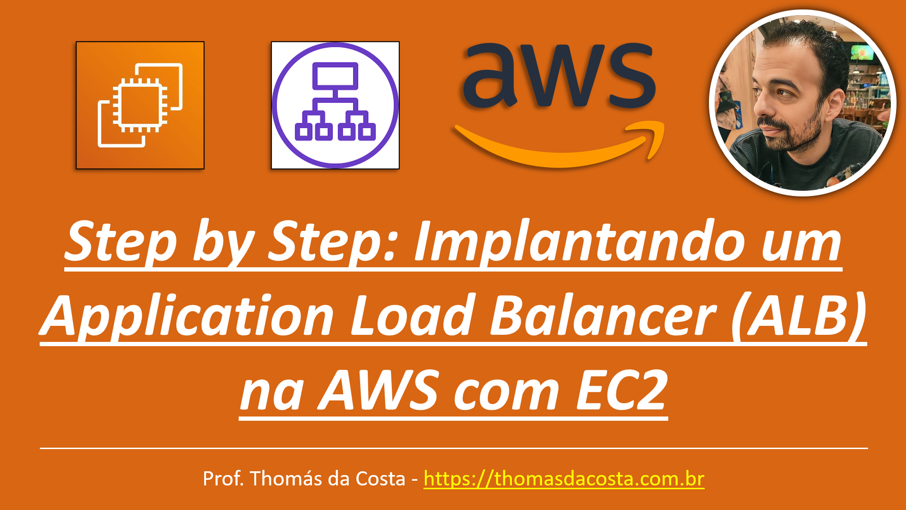

# Balanceamento de Carga - LAB: Implantando um Application Load Balancer (ALB) na AWS com EC2

Tutorial passo a passo de como implantar um Application Load Balancer na AWS direcionando o tráfego para as instâncias EC2 que possuem o servidor Apache HTTP instalado. Neste tutorial, iremos demonstrar como criar ALB, Auto Scaling Group, Target Group e o Launch Template usando AWS Management Console.

## Link do Tutorial

https://thomasdacosta.com.br/2023/04/23/step-by-step-implantando-um-application-load-balancer-alb-na-aws-com-ec2/

---

Thomás da Costa - [https://thomasdacosta.com.br](https://thomasdacosta.com.br)