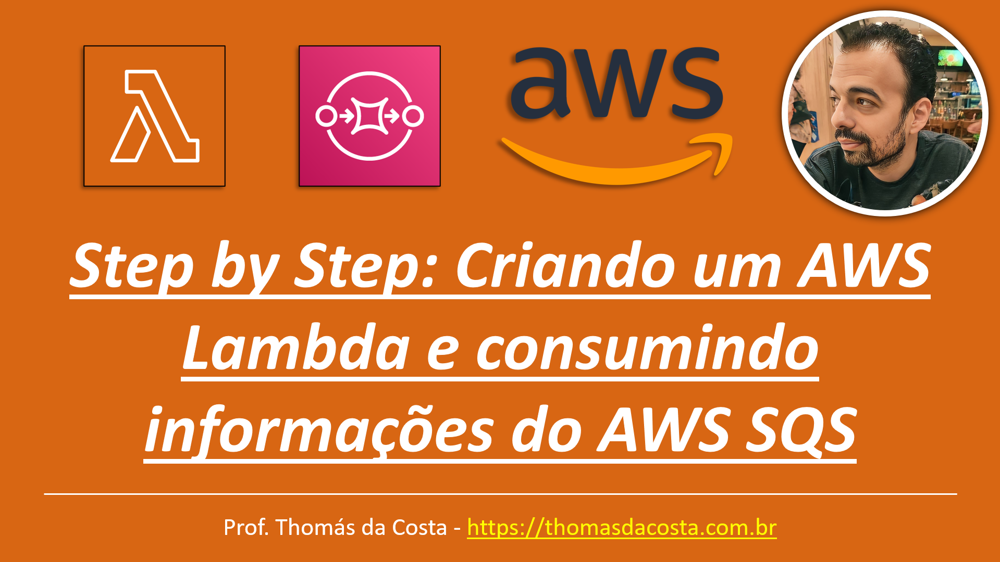

# Serverless - LAB: Criando um AWS Lambda e consumindo informações do AWS SQS

Tutorial passo a passo de como criar um Lambda que consume informações diretamente de um SQS usando AWS Management Console. O arquivo está no formato PDF e pode ser baixado para leitura.

## Link do Tutorial

https://thomasdacosta.com.br/2023/04/15/passo-a-passo-criando-um-aws-lambda-e-consumindo-informacoes-do-aws-sqs/

---

Thomás da Costa - [https://thomasdacosta.com.br](https://thomasdacosta.com.br)